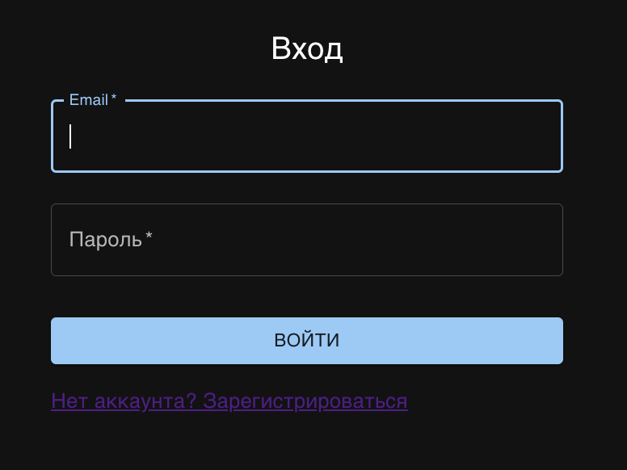
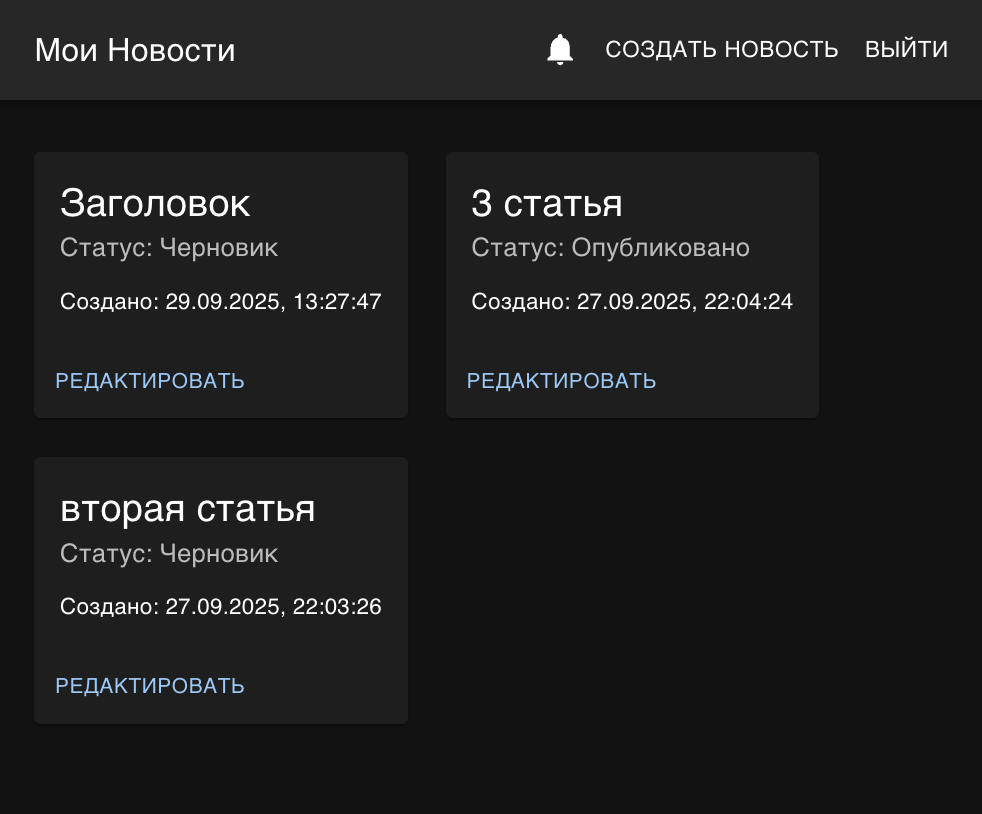
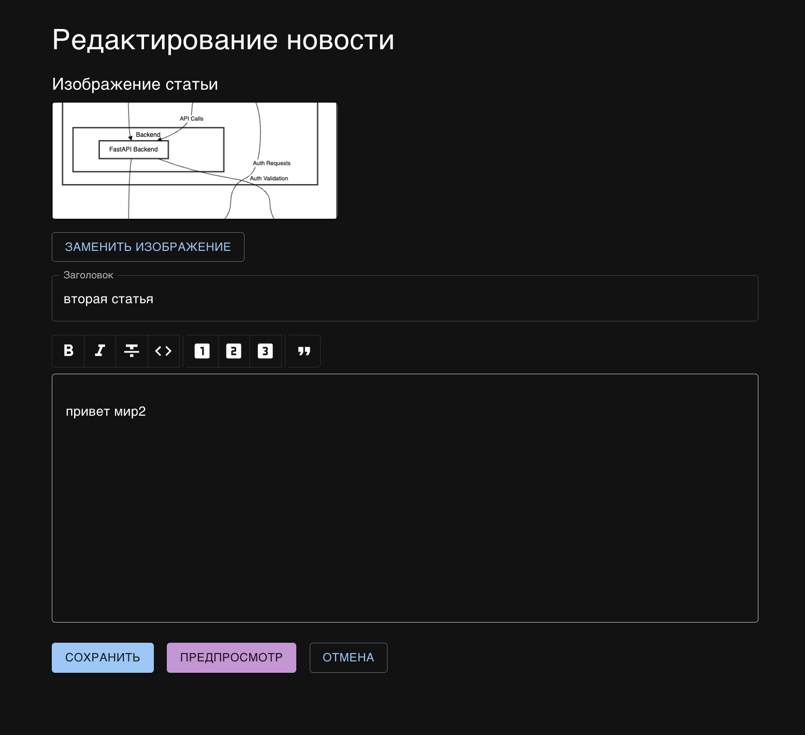
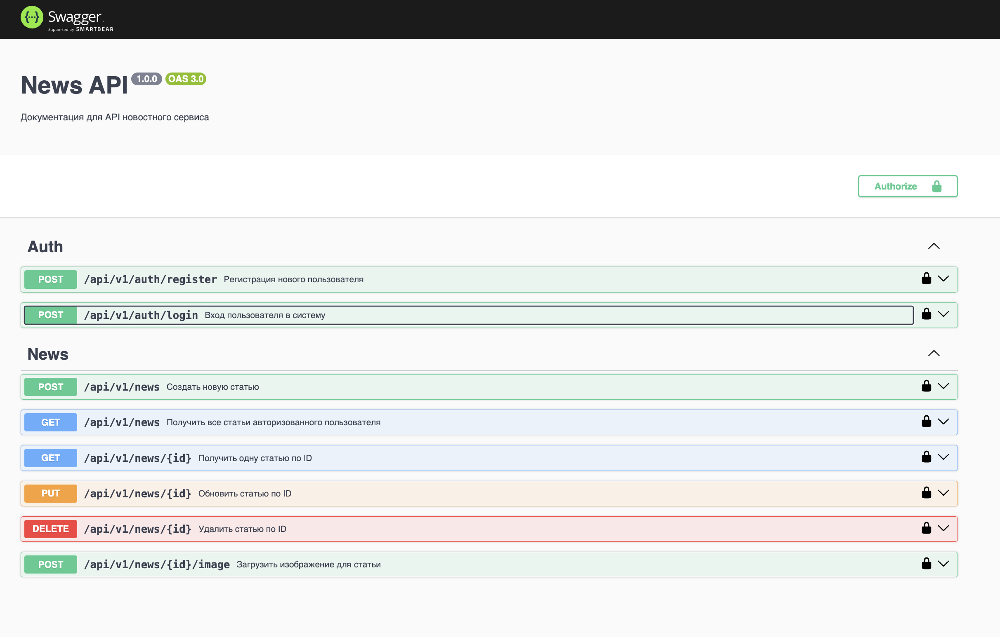

# Новостной API и Редактор статей 

Выполненное тестовое задание представляет собой fullstack-приложение, состоящее из API для новостного сервиса и клиентского редактора статей. Проект контейнеризирован с помощью Docker и Docker Compose для легкого запуска.

## 🚀 Основные возможности

### Backend
- **Аутентификация:** Регистрация и вход на основе `JWT (JSON Web Tokens)`.
- **CRUD для новостей:** Полный набор операций для управления новостными статьями (создание, чтение, обновление, удаление).
- **Отложенная публикация:** Возможность запланировать публикацию статьи на определенную дату и время с помощью `node-cron`.
- **Загрузка файлов:** Загрузка изображений для статей с использованием `multer`.
- **Real-time уведомления:** Мгновенные уведомления о создании/изменении/удалении статей с помощью `Socket.IO`.
- **Трехслойная архитектура:** Четкое разделение на слои контроллеров, сервисов и моделей данных.
- **Документация API:** Интерактивная документация, сгенерированная с помощью `Swagger (OpenAPI)`.
- **Документация кода:** Автоматически сгенерированная документация по коду с помощью `TypeDoc`.

### Frontend
- **Современный стек:** Построен на `React` с использованием функциональных компонентов и хуков.
- **UI-компоненты:** Красивый интерфейс с библиотекой `MUI (Material-UI)`.
- **WYSIWYG Редактор:** Редактор текста `TipTap` с возможностями форматирования (заголовки, жирный/курсив, цитаты).
- **Клиентская маршрутизация:** Навигация по приложению реализована с помощью `React Router`.
- **Защищенные роуты:** Доступ к страницам дашборда и редактора только для авторизованных пользователей.
- **Предпросмотр статей:** Возможность посмотреть, как будет выглядеть статья перед публикацией.
- **Real-time уведомления:** Интерактивный "колокольчик" для отображения уведомлений в реальном времени.

## 📸 Скриншоты

<table>
  <tr>
    <td align="center"><strong>Страница входа</strong></td>
    <td align="center"><strong>Дашборд со статьями</strong></td>
  </tr>
  <tr>
    <td></td>
    <td></td>
  </tr>
  <tr>
    <td align="center"><strong>Редактор статей</strong></td>
    <td align="center"><strong>Документация API (Swagger)</strong></td>
  </tr>
  <tr>
    <td></td>
    <td></td>
  </tr>
</table>

## 🛠️ Технологический стек

| Область | Технология |
|---|---|
| 📦 **Backend** | Node.js, Express, TypeScript, MongoDB (Mongoose), JWT, bcryptjs, Socket.IO, Multer, node-cron |
| 🖥️ **Frontend** | React, TypeScript, Vite, MUI (Material-UI), Axios, React Router, TipTap, Socket.IO Client, SCSS |
| 🐳 **DevOps** | Docker, Docker Compose, Nginx (для раздачи статики фронтенда) |

## ⚙️ Установка и запуск

Проект полностью контейнеризирован, поэтому для запуска не нужно устанавливать Node.js или MongoDB локально.

### Требования
- Git
- Docker
- Docker Compose

### Шаги для запуска
1. **Клонируйте репозиторий:**
   ```bash
   git clone git@github.com:Graffskii/testtask-newsapi.git
   cd testtask-newsapi
   ```

2. **Настройте переменные окружения:**
   В папке `backend/` создайте `.env`.
   ```bash
   touch backend/.env
   ```
   Файл `backend/.env` должен выглядеть так:
   ```env
   PORT=3000

   MONGO_URI=mongodb://mongo:27017/newsdb

   JWT_SECRET=super_secret_key
   ```

3. **Соберите и запустите контейнеры:**
   Выполните эту команду из **корневой папки** проекта:
   ```bash
   docker-compose up --build -d
   ```
   Эта команда скачает все образы, установит зависимости, соберет проекты и запустит все сервисы. 

## 🌐 Доступные сервисы

После успешного запуска будут доступны следующие адреса:

- **Frontend (Клиентское приложение):** [`http://localhost:5173`](http://localhost:5173)
- **Backend (API):** [`http://localhost:3000`](http://localhost:3000)
- **API Документация (Swagger UI):** [`http://localhost:3000/api-docs`](http://localhost:3000/api-docs)
- **Документация кода (TypeDoc):** [`http://localhost:3000/app-docs`](http://localhost:3000/app-docs)

## 📁 Структура проекта

```
.
├── backend/              
│   ├── src/
│   ├── uploads/
│   ├── Dockerfile
│   ├── package.json
│   └── ...
├── frontend/              
│   ├── src/
│   ├── Dockerfile
│   ├── package.json
│   └── ...
├── docker-compose.yml     
└── README.md              
```

## 🧪 Тестирование с помощью Postman

Для удобства тестирования API в репозиторий включена коллекция Postman, которая содержит все доступные эндпоинты.

Файл коллекции можно найти в корне проекта: `testtask-newsapi.postman_collection.json`


**Импортируйте коллекцию**: Откройте Postman, нажмите `File > Import...` и выберите файл `testtask-newsapi.postman_collection.json` из репозитория.
